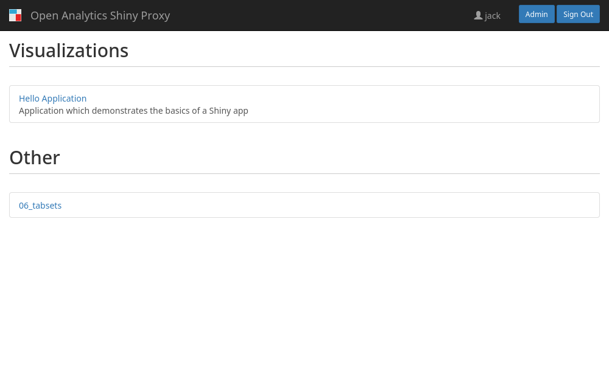

# Example: template groups

Since ShinyProxy 2.6.0 it is possible to group apps on the overview page. It is
possible to specify custom groups and assign apps to these groups.

## How to run

1. Download [ShinyProxy](https://www.shinyproxy.io/downloads "ShinyProxy website")
2. Download the `application.yml` configuration file from the folder where this README is located.
3. Place the jar and yml files in the same directory, e.g. `/home/user/sp`
4. Open a terminal, go to the directory `/home/user/sp`, and run the following command:

`java -jar shinyproxy.jar`

## How it works

See the documentation for the [`template-groups`]() and [`template-group`]().
These are the only properties required to make this work.

Screenshot:



**Note**: as is visible on the screenshot, apps that are not part of a group (or
of a non-existing group) are grouped into the `Other` group.

## Using additional metadata for a group

It is possible to specify extra metadata for a group. The default template of
ShinyProxy only uses the `id` and `display-name` properties. Let's assume you
want to specify `maintainer` for each group:

```yaml
proxy:
  template-groups:
    - id: tools
      properties:
        display-name: Tools
        maintainer: Tesla
    - id: visualizations
      properties:
        display-name: visualizations
        maintainer: Einstein
    - id: documentation
      properties:
        display-name: Documentation
```

You can now modify the templates of ShinyProxy to use this property:

```html
<!-- Part that shows a list when none of the apps contain a logo -->
<div class="container-fluid">
    <div class="row">
        <div id="applist" th:class="${myAppsMode == 'Inline' ? 'col-xs-12 col-md-4 col-md-offset-3 col-lg-5 col-lg-offset-3' : 'col-lg-6 col-lg-offset-3'}">
            <div th:if="${groupedApps.isEmpty() && ungroupedApps.isEmpty()}"  class="alert alert-info" role="alert" s>
                <b>There are no apps available for you.</b>
            </div>
            <th:block th:each="group: ${templateGroups}">
                <h2 th:text="${group.properties.get('display-name')}"></h2>
                <b>Maintainer: <th:block th:text="${group.properties.get('maintainer')}"/></b>
                <ul class="list-group">
                    <th:block th:each="app: ${groupedApps.get(group.id)}" th:include="index :: app(${app})"/>
                </ul>
                <br>
            </th:block>
            <th:block th:if="${ungroupedApps.size() > 0}">
                <!-- Only show the "Other" header if there are other groups with apps -->
                <h2 th:if="${groupedApps.size() > 0}">Other</h2>
                <ul class="list-group">
                    <th:block th:each="app: ${ungroupedApps}" th:include="index :: app(${app})"/>
                </ul>
            </th:block>
        </div>
</div>
```
