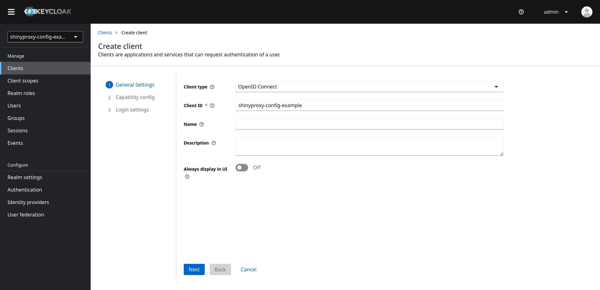
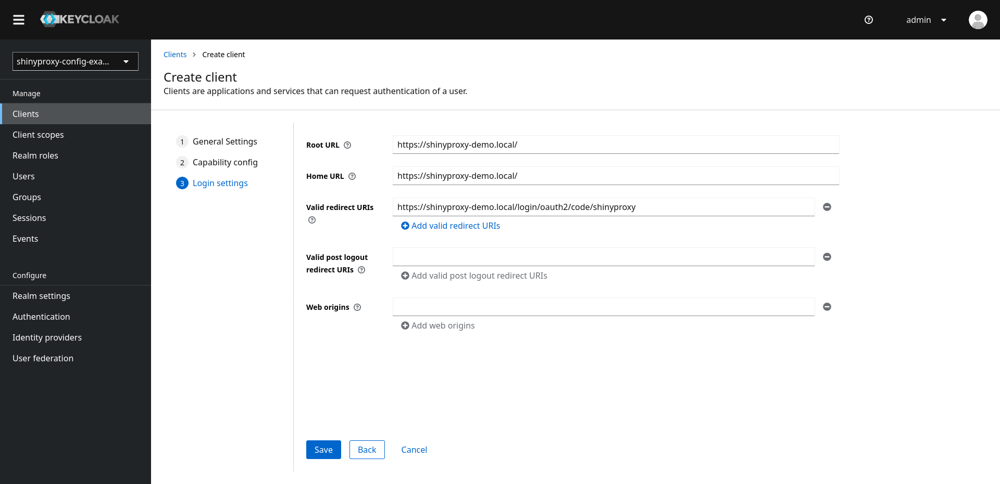
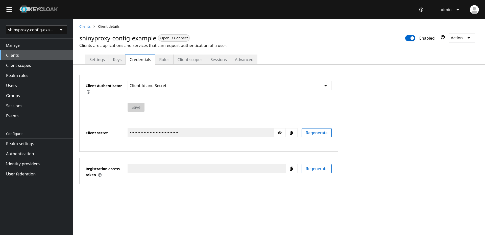
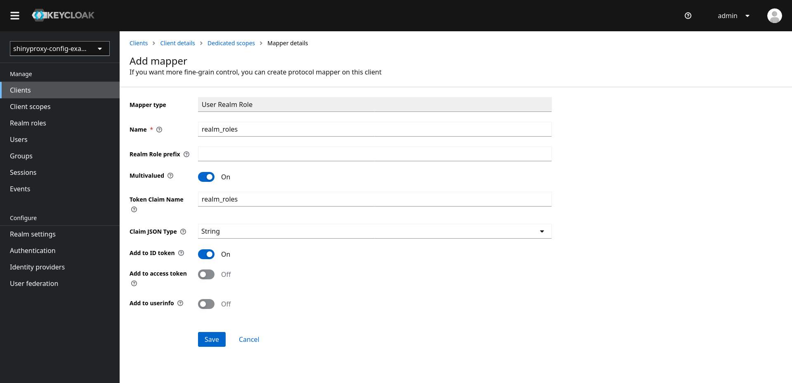
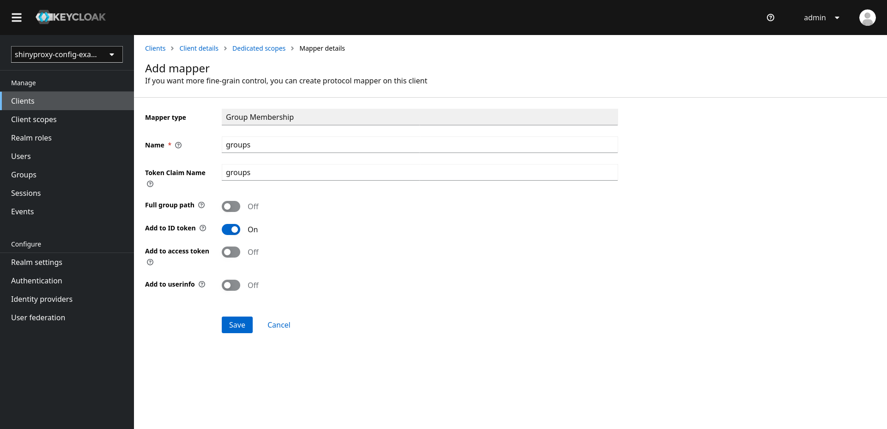
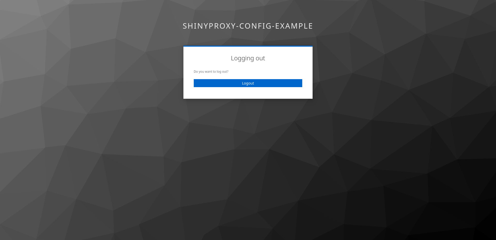
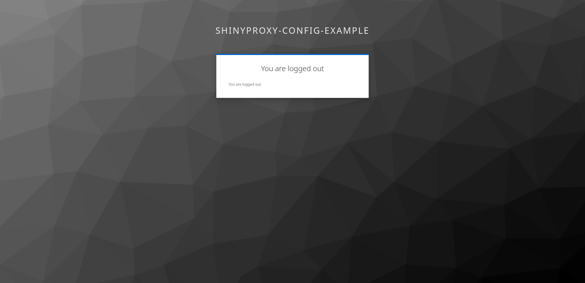

# Example: integrating ShinyProxy with Keycloak

ShinyProxy can integrate with any OIDC provider, this example specifically
demonstrates how to integrate ShinyProxy with Keycloak.

> [!NOTE]  
> We do our best to document the steps in Keycloak, however, Keycloak
> may change and this documentation may get outdated. Please open an issue or PR
> in this case.

It's a good idea to first read the
general [ShinyProxy OpenID documentation](https://shinyproxy.io/documentation/configuration/#openid-connect-oidc).

## Setting up Keycloak

The complete setup and configuration of Keycloak is out of the scope of this
example. Check
the [Keycloak documentation](https://www.keycloak.org/documentation)
and
the [Docker example](https://www.keycloak.org/getting-started/getting-started-docker)
for more information.

## Configuring Keycloak

1. Login into Keycloak
2. Create or select a realm
3. Click on `Clients`, Click on `Create client`
4. Provide a `Client ID` and remember this value, click `Next`

   [](img/01_create_client.png)

5. Enable `Client authentication`, disable `Direct access grants`, make
   sure `Standard flow` is enabled, click `Next`

   [](img/02_create_client.png)

6. Fill in the location of ShinyProxy (without any sub-path) in `Root URL`
   and `Home URL`.
7. Add the following as `Valid redirect URI` (replacing `shinyproxy-demo.local`
   with your domain name):

   ```text
   https://shinyproxy-demo.local/login/oauth2/code/shinyproxy
   ```

8. The filled in form should look like:

   [](img/03_create_client.png)

9. Go to the `Credentials` tab and copy the `Client secret` value. You'll need
   this in the ShinyProxy configuration.

   [](img/04_client_secret.png)

10. Go to `Realm settings` (in the sidebar) and click
    on `OpenID Endpoint Configuration`

    [](img/05_endpoints.png)

11. Copy the following fields from the JSON:

    - `authorization_endpoint`
    - `token_endpoint`
    - `jwks_uri`

## Configuring ShinyProxy

Now that you configured Keycloak and you retrieved all parameters, you can
configure ShinyProxy.

1. Add the following configuration to your ShinyProxy config (replace the
   examples with the values you retrieved from Keycloak):

    ```yaml
    proxy:
      authentication: openid
      openid:
        # see step 11 (of previous section): authorization_endpoint
        auth-url: https://keycloak-demo.local/auth/realms/master/protocol/openid-connect/auth
        # see step 11 (of previous section): token_endpoint
        token-url: https://keycloak-demo.local/auth/realms/master/protocol/openid-connect/token
        # see step 11 (of previous section): jwks_uri
        jwks-url: https://keycloak-demo.local/auth/realms/master/protocol/openid-connect/certs
        # see step 4 (of previous section)
        client-id: shinyproxy-config-example
        # see step 9 (of previous section)
        client-secret: 1aB...
        username-attribute: preferred_username
    ```

2. Restart ShinyProxy

You should now be able to log in on ShinyProxy using a Keycloak user. You can
create additional users by going to the `Users` page in Keycloak.

## Configuring the username

The current setup will use the `preferred_username` of the user to identify it
(this is e.g. shown in the navigation bar of ShinyProxy). This corresponds to
the username field in the Keycloak UI. By default keycloak sends most user
information as part of the ID token. Therefore, you can immediately use these
values to identify the user. For example, to use the email address, change the
change the `proxy.openid.username-attribute` in ShinyProxy to `email`:

   ```yaml
   proxy:
     openid:
       username-attribute: email
   ```

> [!NOTE]  
> Make sure that every user has an email address configured. Otherwise, the
> user will get an error when logging in.

It's possible to see all claims which are being sent to ShinyProxy,
see [the documentation](https://shinyproxy.io/documentation/troubleshooting/#listing-all-claims-sent-by-the-openid-provider).

## Configuring roles

In Keycloak, it's possible to assign (multiple) roles to a user. These roles
can be used in ShinyProxy as groups, e.g. for adding authorization to apps.

1. Login into Keycloak
2. Select a realm
3. Go to `Clients` and select the client you created for ShinyProxy
4. Go the `Client Scopes` tab
5. Click on the first scope, e.g. `shinyproxy-config-example-dedicated`

   [](img/06_roles.png)

6. Click on `Add mapper`, click on `By configuration` (or immediately click
   on `Configure a new mapper`)
7. Click on `User Realm Role`
8. Use `realm_roles` as `Name`
9. Keep `Realm Role prefix` empty
10. Keep the `Multivalued` option enabled,
11. Use `realm_roles` as `Token Claim Name`
12. Use `String` as `Claim JSON type`
13. Ensure the `Add to ID token` option is selected
14. The `Add to access token` or `Add to userinfo` options may optionally be
    enabled, but aren't required for ShinyProxy

    [](img/07_roles.png)

15. Click `Save`
16. Add the `proxy.openid.roles-claim` property to the ShinyProxy config:

    ```yaml
    proxy:
      openid:
        roles-claim: realm_roles
    ```

17. Restart ShinyProxy

When a user now logs in on ShinyProxy, Keycloak sends the roles of that user to
ShinyProxy. You can check whether this works by starting an app and retrieving
the `SHINYPROXY_USERGROUPS` environment variable.

## Configuring groups

In addition to roles, Keycloak also supports the concept of groups,
see [Keycloak docs](https://www.keycloak.org/docs/latest/server_admin/#con-comparing-groups-roles_server_administration_guide)
for the difference. Both Keycloak groups and Keycloak roles can be used in
ShinyProxy as groups, e.g. for adding authorization to apps. It's, however, not
possible to use both roles and groups at the same time in ShinyProxy.

1. Login into Keycloak
2. Select a realm
3. Go to `Clients` and select the client you created for ShinyProxy
4. Go the `Client Scopes` tab
5. Click on the first scope, e.g. `shinyproxy-config-example-dedicated`

   [](img/06_roles.png)

6. Click on `Add mapper`, click on `By configuration` (or immediately click
   on `Configure a new mapper`)
7. Click on `Group Membership`
8. Use `groups` as `Name`
9. Use `groups` as `Token Claim Name`
10. Switch off the `Full group path` option
11. Ensure the `Add to ID token` option is selected
12. The `Add to access token` or `Add to userinfo` options may optionally be
    enabled, but aren't required for ShinyProxy

    [](img/08_groups.png)

13. Click `Save`
14. Add the `proxy.openid.roles-claim` property to the ShinyProxy config:

    ```yaml
    proxy:
      openid:
        roles-claim: groups
    ```

15. Restart ShinyProxy

When a user now logs in on ShinyProxy, Keycloak sends the groups of that user to
ShinyProxy. You can check whether this works by starting an app and retrieving
the `SHINYPROXY_USERGROUPS` environment variable.

**Note**: don't use the built-in groups mapper of Keycloak as this mapper
provides the realm-roles of the user and not the groups.

## Logout

When clicking the logout button in the current setup, the user will just be
logged out from ShinyProxy. You can configure ShinyProxy to logout the user in
Keycloak:

1. Go to the `OpenID Endpoint Configuration` in Keycloak (see the first section)
   and copy the `end_session_endpoint` value.
2. Add the `proxy.openid.logout-url` property to the ShinyProxy config:

    ```yaml
    proxy:
      openid:
        logout-url: https://keycloak-demo.local/auth/realms/master/protocol/openid-connect/logout
    ```

3. Restart ShinyProxy

**Note**:

- When a user clicks the logout button, Keycloak will ask the user whether they
  really want to logout:

  [](img/09_logout.png)

  If you want to automatically sign out the user you'll have to
  add `?id_token_hint=#{oidcUser.idToken.tokenValue}` to the end of
  the `logout-url`:

    ```yaml
    proxy:
      openid:
        logout-url: https://keycloak-demo.local/auth/realms/master/protocol/openid-connect/logout?id_token_hint=#{oidcUser.idToken.tokenValue}
    ```

- When the user is logged out, Keycloak shows a confirmation screen:

  [](img/10_logout.png)

  You can redirect the user to a different URL by adding
  the `post_logout_redirect_uri` parameter to the URL (in this case
  the `id_token_hint` is mandatory):

   ```yaml
   proxy:
     openid:
        logout-url: https://keycloak-demo.local/auth/realms/master/protocol/openid-connect/logout?id_token_hint=#{oidcUser.idToken.tokenValue}&post_logout_redirect_uri=http%3A%2F%2Fshinyproxy-demo.local/logout-success
   ```

  In this setup Keycloak is (virtually) invisible to the user.

## Migration from Keycloak authentication

Up to version 3.0.x, ShinyProxy included a dedicated `keycloak` authentication
backend. This backend was using the official Keycloak Java library, however,
this library was deprecated by the Keycloak developers. In addition,
the `openid` backend is fully compatible with Keycloak and has more
(advances) features. Therefore, we deprecated the `keycloak` backend in
ShinyProxy 3.0.0 (by adding a warning in the release notes and documentation)
and starting with version 3.1.0 of ShinyProxy, the Keycloak backend has been
removed. This section explains how you can easily migrate from the old backend
to the new one.

1. Find you current Keycloak configuration, for example:

    ```yaml
    proxy:
      authentication: keycloak
      keycloak:
        realm: master
        auth-server-url: https://keycloak-demo.local/auth
        resource: shinyproxy-config-example
        credentials-secret: example_secret
    ```

2. Follow the steps in [Configuring roles](#configuring-roles), such that
   Keycloak sends the roles of a user to ShinyPoxy
3. Change the ShinyProxy config to use OpenID (remove the keycloak config):

    ```yaml
    proxy:
      authentication: openid
      openid:
        # corresponds to {auth-server-url}/realms/{realm}/protocol/openid-connect/auth
        # where "{auth-server-url} and "{realm}" are the old Keycloak configuration properties
        auth-url: https://keycloak-demo.local/auth/realms/master/protocol/openid-connect/auth
        # corresponds to {auth-server-url}/realms/{realm}/protocol/openid-connect/token
        # where "{auth-server-url} and "{realm}" are the old Keycloak configuration properties
        token-url: https://keycloak-demo.local/auth/realms/master/protocol/openid-connect/token
        # corresponds to {auth-server-url}/realms/{realm}/protocol/openid-connect/certs
        # where "{auth-server-url} and "{realm}" are the old Keycloak configuration properties
        jwks-url: https://keycloak-demo.local/auth/realms/master/protocol/openid-connect/certs
        # corresponds to "resource" in the old Keycloak configuration properties
        client-id: shinyproxy-config-example
        # corresponds to "credentials-secret" in the old Keycloak configuration properties
        client-secret: example_secret
        # equivalent of proxy.keycloak.name-attribute
        # the Keycloak default is "name"
        username-attribute: name
    ```

4. [Configure the logout URL](#logout)
5. Optionally: [Configure the username](#configuring-the-username)
6. Restart ShinyProxy

## References

- [Keycloak getting started docs](https://www.keycloak.org/guides#getting-started)
- [Keycloak Server Administration docs](https://www.keycloak.org/docs/latest/server_admin/index.html)
- [ShinyProxy OpenID documentation](https://shinyproxy.io/documentation/configuration/#openid-connect-oidc)
- [ShinyProxy SpEL documentation](https://shinyproxy.io/documentation/spel/)
- [ShinyProxy Troubleshooting OpenID documentation](https://shinyproxy.io/documentation/troubleshooting/#openid-connect-oidc)
- [ShinyProxy Docs on using environment variables](https://shinyproxy.io/documentation/configuration/#config-env-var)
