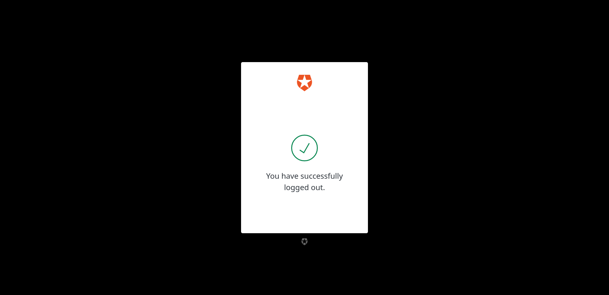

# Example: integrating ShinyProxy with Auth0

ShinyProxy can integrate with any OIDC provider, this example specifically
demonstrates how to integrate ShinyProxy with Auth0.

> [!NOTE]  
> We do our best to document the steps in Auth0, however, Auth0
> may change and this documentation may get outdated. Please open an issue or PR
> in this case.

It's a good idea to first read the
general [ShinyProxy OpenID documentation](https://shinyproxy.io/documentation/configuration/#openid-connect-oidc).

## Configuring Auth0

1. Login into Auth0
2. Click on `Applications` and click again on `Applications`
3. Click on `Create Application`
4. Provide a name for the application and select `Native`

   [](img/01_create_application.png)

5. On the new page, copy the `Domain`, `Client ID` and `Client Secret`. You'll
   need this in the ShinyProxy configuration.
6. Scroll down to `Application URIs`
7. Fill in the location of ShinyProxy (without any sub-path)
   in `Application Login URI`
8. Add the following as `Allowed callback URLs`
   (replacing `shinyproxy-demo.local`
   with your domain name):

   ```text
   https://shinyproxy-demo.local/login/oauth2/code/shinyproxy
   ```

9. The filled in form should look like:

   [](img/02_application_urls.png)

## Configuring ShinyProxy

Now that you configured Auth0 and you retrieved all parameters, you can
configure ShinyProxy.

1. Add the following configuration to your ShinyProxy config (replace the
   examples with the values you retrieved from Auth0). In this
   example `https://dev-abc123xyz.eu.auth0.com/` is used as the Auth0 domain:

    ```yaml
    proxy:
      authentication: openid
      openid:
        # see step 5 (of previous section): domain + "/authorize"
        auth-url: https://dev-abc123xyz.eu.auth0.com/authorize
        # see step 5 (of previous section): domain + "/oauth/token"
        token-url: https://dev-abc123xyz.eu.auth0.com/oauth/token
        # see step 5 (of previous section) domain + "/.well-known/jwks.json"
        jwks-url: https://dev-abc123xyz.eu.auth0.com/
        # see step 5: Client ID
        client-id: shinyproxy-config-example
        # see step 6: Client Secret
        client-secret: 1aB...
    ```

2. Restart ShinyProxy

You should now be able to login into ShinyProxy using an Auth0 user. You can
create additional users by going to the `User Management` -> `Users` page in
Auth0.

## Configuring the username

The current setup will use the `email` of the user to identify it
(this is e.g. shown in the navigation bar of ShinyProxy). This corresponds to
the email field in the Auth0 UI. The following example sends the `nickname` of
the user as an additional claim to ShinyProxy.

1. Login into Auth0
2. Click on `Actions`, click on `Library`
3. Click on `Create Action`, click on `Build from scratch`
4. Fill in a name
5. Use `Login / Post Login` as `Trigger`
6. Click on `Create`

   [](img/03_action_create.png)

7. Modify the code to be (the name of the claim should be a URI-link namespace):

    ```js
    exports.onExecutePostLogin = async (event, api) => {
        api.idToken.setCustomClaim("https://shinyproxy.io/nickname",  event.user.nickname);
   };
    ```

   [](img/04_action_code.png)

8. Click on `Deploy`
9. Go to `Flows` (in the left sidebar)
10. Click on `Login`
11. In the right section, click on `Custom`
12. Drag and drop your custom action into the flow

    [](img/05_flow.png)

13. Click on `Apply`
14. Add the `proxy.openid.username-attribute` property in the ShinyProxy
    configuration:

    ```yaml
    proxy:
      openid:
        username-attribute: "https://shinyproxy.io/nickname"
    ```
15. Restart ShinyProxy

When a user now logs in on ShinyProxy, the user is identified by their nickname.

It's possible to see all claims which are being sent to ShinyProxy,
see [the documentation](https://shinyproxy.io/documentation/troubleshooting/#listing-all-claims-sent-by-the-openid-provider).

## Configuring roles

In Auth0, it's possible to assign (multiple) roles to a user. These roles can
be used in ShinyProxy as groups, e.g. for adding authorization to apps.

> [!NOTE]  
> Previous versions of our documentation, suggested to use a custom property in
> the `app_metadata`, instead of using native Auth0 rules. See the next section
> for an example.

1. Follow the steps in [Configuring the username](#configuring-the-username) in
   order to setup a custom Action and Flow (you can skip the last step).
2. In Auth0, click on `Actions`, click on `Library`, click on `Custom` and
   finally click on your custom Action
3. Modify the code to be (you can remove the nickname attribute if you don't
   need it):

    ```js
    exports.onExecutePostLogin = async (event, api) => {
        api.idToken.setCustomClaim("https://shinyproxy.io/nickname", event.user.nickname);
        api.idToken.setCustomClaim("https://shinyproxy.io/shinyproxy_roles", event.authorization.roles);
    };
    ```

4. Click on `Deploy`.
5. Add the `proxy.openid.roles-claim` property to the ShinyProxy config:

    ```yaml
    proxy:
      openid:
        roles-claim: "https://shinyproxy.io/shinyproxy_roles"
    ```

6. Restart ShinyProxy

When a user now logs in on ShinyProxy, Auth0 sends the roles of that user to
ShinyProxy. You can check whether this works by starting an app and retrieving
the `SHINYPROXY_USERGROUPS` environment variable.

## Adding custom attributes to a user

Besides using the native roles function of Auth0, it's also possible to use
custom metadata to send roles to ShinyProxy (or any other value):

1. Follow the steps in [Configuring the username](#configuring-the-username) in
   order to setup a custom Action and Flow (you can skip the last step).
2. Go to `User Management`, `Users`, select a user
3. Scroll down to `App Metadata` and add the following JSON:

   ```json
   {
      "shinyproxy_roles": [ "scientists", "mathematicians" ]
   }
   ```

   [](img/06_app_metadata.png)

4. Click on `Save`
5. In the left sidebar, click on `Actions`, click on `Library`, click
   on `Custom` and finally click on your custom Action
6. Modify the code to be (you can remove the nickname attribute if you don't
   need it):

    ```js
    exports.onExecutePostLogin = async (event, api) => {
        api.idToken.setCustomClaim("https://shinyproxy.io/nickname", event.user.nickname);
        api.idToken.setCustomClaim("https://shinyproxy.io/shinyproxy_roles", event.user.app_metadata.shinyproxy_roles);
    };
    ```

7. Click on `Deploy`.
8. Add the `proxy.openid.roles-claim` property to the ShinyProxy config:

    ```yaml
    proxy:
      openid:
        roles-claim: "https://shinyproxy.io/shinyproxy_roles"
    ```

9. Restart ShinyProxy

When a user now logs in on ShinyProxy, Auth0 sends the value of
the `shinyproxy_roles` property in the `app_metadata` of that user to
ShinyProxy. You can check whether this works by starting an app and retrieving
the `SHINYPROXY_USERGROUPS` environment variable.

## Logout

When clicking the logout button in the current setup, the user will just be
logged out from ShinyProxy. You can configure ShinyProxy to logout the user in
Auth0:

1. Get your Auth0 domain (see the [first section](#configuring-auth0))
2. Go to Auth0, click on `Settings` and click on `Advances`
3. Enable `RP-Initiated Logout End Session Endpoint Discovery`
4. It's recommend to keep `RP-Initiated Logout End-User Confirmation` enabled

   [](img/07_logout.png)

5. Click save
6. Add the `proxy.openid.logout-url` property to the ShinyProxy config:

    ```yaml
    proxy:
      openid:
        # see step 5 (of first section): domain + "oidc/logout?id_token_hint=#{oidcUser.idToken.tokenValue}"
        auth-url: https://dev-abc123xyz.eu.auth0.com/oidc/logout?id_token_hint=#{oidcUser.idToken.tokenValue}
    ```

7. Restart ShinyProxy

**Note**:

- When the user is logged out, Auth0 shows a confirmation screen:

  [](img/08_logout_confirmation.png)

  You can redirect the user to a different URL by adding
  the `post_logout_redirect_uri` parameter to the URL:

   ```yaml
   proxy:
     openid:
        logout-url: https://dev-abc123xyz.eu.auth0.com/oidc/logout?id_token_hint=#{oidcUser.idToken.tokenValue}&post_logout_redirect_uri=http%3A%2F%2Fshinyproxy-demo.local/logout-success
   ```

  You'll also have to add the URL to the `Allowed Logout URLs` of the Auth0
  application.

## References

- [Auth0: test Actions](https://auth0.com/docs/customize/actions/test-actions)
- [Auth0: add roles to ID token](https://community.auth0.com/t/how-to-add-roles-and-permissions-to-the-id-token-using-actions/84506)
- [Auth0: logout](https://auth0.com/docs/authenticate/login/logout/log-users-out-of-auth0)
- [ShinyProxy OpenID documentation](https://shinyproxy.io/documentation/configuration/#openid-connect-oidc)
- [ShinyProxy SpEL documentation](https://shinyproxy.io/documentation/spel/)
- [ShinyProxy Troubleshooting OpenID documentation](https://shinyproxy.io/documentation/troubleshooting/#openid-connect-oidc)
- [ShinyProxy Docs on using environment variables](https://shinyproxy.io/documentation/configuration/#config-env-var)
